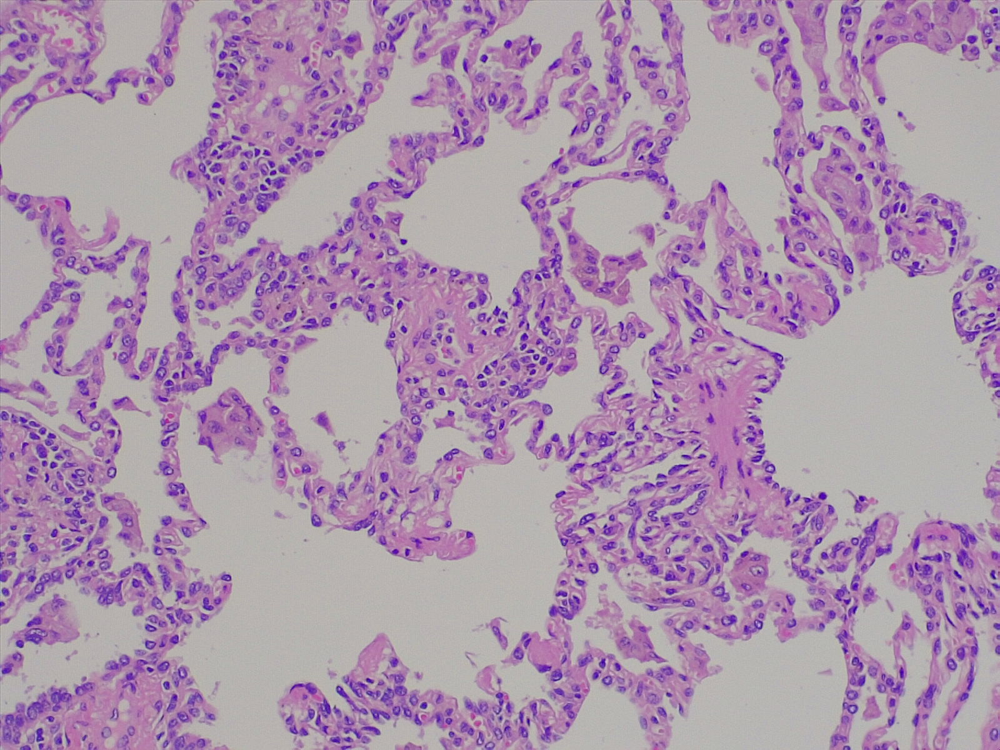

# Actividad de Visión por Computador: Clasificación de Histopatología de Cáncer de Pulmón
## 1. Introducción
¡Bienvenido/a al reto de clasificación de imágenes histopatológicas de cáncer de pulmón! El objetivo principal de este desafío es evaluar tus habilidades para desarrollar e implementar soluciones de machine learning y visión por computador. Más que la optimización de métricas, nos enfocaremos en la calidad, estructura y claridad de tu código y la metodología que propongas.

## 2. Descripción del Problema y del Conjunto de Datos
El reto consiste en construir un modelo de clasificación de imágenes para distinguir entre diferentes tipos de tejidos pulmonares. Para ello, utilizarás un conjunto de datos público de imágenes histopatológicas de tejido pulmonar.

Este conjunto de datos contiene 691 imágenes histopatológicas de alta resolución (1200x1600 píxeles) de 45 pacientes, organizadas en siete clases. Dichas clases se derivan de tres categorías principales: tejido normal (nor), adenocarcinoma (aca) y carcinoma de células escamosas (scc). Estos dos últimos se subdividen adicionalmente por su grado de diferenciación: bien (bd), moderadamente (md) y pobremente diferenciado (pd).

Enlace al conjunto de datos: [Conjunto de Datos de Histopatología Pulmonar](https://drive.google.com/file/d/1vHpktP4M3uQOoh_QlBAqcvC111o8e5ef/view?usp=sharing)

## 3. Instrucciones de la Actividad
- Modelo: Puedes utilizar cualquier tipo de modelo, tanto de deep learning (ej. CNNs) como de machine learning tradicional (ej. SVM con extractores de características).

- Pre-procesamiento: Puedes aplicar las técnicas de pre-procesamiento que consideres necesarias para mejorar el rendimiento del modelo (aumento de datos, normalización, etc.).

- Librerías: Eres libre de utilizar las librerías que necesites (ej. TensorFlow, PyTorch, Scikit-learn, OpenCV).

- Restricciones Computacionales: El proceso completo de entrenamiento y evaluación de tu modelo no debe superar 1 hora en una CPU estándar. Como referencia, un modelo ResNet18 entrenado y evaluado durante 10 épocas en este dataset toma aproximadamente 16 minutos.

- Tiempo Estimado: Este reto está diseñado para ser completado en un máximo de **4 horas**. La eficiencia es clave, por lo que te animamos a utilizar funciones, clases o modelos pre-entrenados ya existentes.

- Foco del Código: Concéntrate en implementar las funciones y clases estrictamente necesarias para cargar los datos, entrenar el modelo y evaluarlo. No es necesario ni preferible añadir funcionalidades adicionales que no contribuyan directamente a estos pasos.

## 4. Entregables
Deberás proporcionar lo siguiente:

- Repositorio en GitHub: Un enlace a un repositorio público que contenga:

  - El código fuente completo y funcional para entrenar y evaluar tu modelo.

  - Un archivo README.md el cual debe tener instrucciones claras sobre ejecutar tu código. También, debe mencionar el modelo seleccionado, explicar brevemente las técnicas de pre-procesamiento (si aplica) y mencionar los hiperparámetros utilizados. Finalmente, debes mostrar las métricas de evaluación que obtuviste. Recuerda que las métricas no serán el factor determinante en la evaluación.

## 5. Criterios de Evaluación
Se evaluará principalmente:

- La claridad, organización y reproducibilidad de tu código.

- La correcta aplicación de los conceptos de machine learning/deep learning.

Posteriormente, es posible que se agende una breve reunión para revisar tu código y discutir las decisiones de diseño que tomaste.

¡Mucho éxito!
